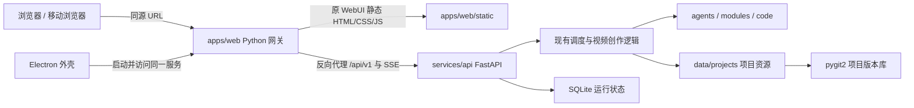

# VideoAgents 产品架构

## 目标与边界

本版本是一次性产品化迁移，不保留旧 Web API 的兼容层。系统面向单租户、多客户端使用：同一套 Python 服务可以同时被浏览器、桌面客户端和其他 API 客户端访问，不引入用户、租户或权限模型。

迁移遵循两个边界：

1. 视频创作领域保持稳定。`agents/`、`modules/`、`code/` 及 `data/` 不因产品外壳重构而改名或搬迁。
2. 产品接口重新定义。所有对外能力只通过有类型、可生成 OpenAPI 的 `/api/v1` 暴露，旧 `/api/*` 路径直接返回 404。

## 运行架构



浏览器模式下，`apps/web/server.py` 原样提供原 WebUI 静态资源，并把 `/api/v1` 反向代理到独立的 `services/api`，因此请求天然同源，不需要 CORS。Electron 不实现第二套静态服务或代理，只负责启动同一个 Python Web 网关并打开其 URL；也可让该网关代理 `VIDEOAGENTS_API_URL` 指定的远程 API。

`apps/web/static` 是从旧 `webui/static` 完整迁入的唯一界面源码。HTML 结构、CSS、图片与多语言资源不再经过 Vue/Vite 重建，仅将页面 JavaScript 的请求改为正式 `/api/v1` 定义。浏览器和 Electron 消费同一 URL 服务，体验不会因客户端分叉。

## 目录职责

```text
apps/
  web/             原 WebUI 静态页面、Python 静态服务与 API 反向代理
  desktop/         Electron 生命周期、原生能力、Web 服务进程、更新和安装包
services/
  api/             FastAPI 产品接口、Schema、SQLite 状态和启动入口
  runtime/         Agent 调度、项目业务、预览、Provider、版本与内部工具
agents/            83 个创作 Agent、工作流文档及 DAG
modules/           媒体、音频、执行引擎、项目版本等领域适配器
code/              仓库/成片校验和生产工具，不是前端源代码目录
data/projects/     运行时视频剪辑项目、输入资源和生成产物
data/.videoagents/ 可重建/可迁移的运行状态，例如 SQLite
tests/             Python 产品接口、领域完整性和版本管理测试
```

### `apps/web` 与 `apps/desktop` 的关系

`apps/web` 是完整的可运行 Web 客户端：`static/` 是实际界面，`server.py` 提供页面、同源 `/api/v1` 反向代理及少量本机操作。它既不依赖 Electron API，也不知道自己运行在桌面客户端还是普通浏览器中。`apps/desktop` 不复制页面、服务器实现或业务状态，只负责：

- 建立安全的 BrowserWindow 和最小化 preload 接口；
- 使用首次启动时独立下载的 Python 运行时启动 `apps/web/server.py`；该服务再启动本地 API，或代理 `VIDEOAGENTS_API_URL` 指定的远程 API；
- 安装包、应用生命周期和自动更新。

因此 Web 可以独立演进和通过 URL 使用，Desktop 只是它的一种承载方式。

### 为什么目前没有 `packages/`

在 JavaScript monorepo 中，`packages/` 通常放多个应用共享并独立版本化的库，例如：

- 从 OpenAPI 生成的 API 客户端和类型；
- Web 与 Electron preload 共用的 IPC 协议；
- 多个前端共用的设计系统组件；
- 统一日志、配置和测试工具。

目前只有一个 UI，Electron 只提供很小的原生桥接。过早拆包只会增加构建和版本关系，所以本次没有创建空壳 `packages/`。当出现第二个独立前端，或共享协议增长到需要单独测试/发布时，再将 API client、contracts、ui-kit 分别提升到 `packages/`，不会影响当前运行架构。

### 为什么使用 `services/api/`

仓库根目录已经代表 VideoAgents 产品，再用同名 `videoagents/` 表示其中一个后端部署单元，会混淆产品命名空间和服务职责。现在按部署形态划分：`apps/` 放置由用户直接运行的 Web/Electron 客户端，`services/` 放置可独立启动的长期运行服务，`services/api/` 明确表示公开 Python API 服务。

产品 API 与执行业务均已迁入 `services/`：`api/` 只负责公开协议与传输，`runtime/` 负责调度和业务实现。`agents/`、`modules/`、`code/` 和 `data/` 仍是稳定的领域与资源根目录，因此没有为形式统一而引入 `services/api/src/` 或改写这些领域路径。

`code/` 没有消失；它仍是工作流使用的校验和生产工具目录。`agents/` 与 `modules/` 也没有转移，因为它们是现有视频创作领域的一部分，而非产品 API 层。

## API 与状态

- 唯一公开前缀：`/api/v1`。
- OpenAPI：`/api/v1/openapi.json`，交互文档：`/api/v1/docs`。
- 请求/响应使用 Pydantic Schema 描述；客户端不再调用 Python 内部函数或旧路由。
- 运行、人工确认和事件序列持久化到 SQLite；SSE 支持 `Last-Event-ID`/`after` 断线续传。
- `data/projects/` 始终是视频项目的资源目录，不会迁入数据库。SQLite 只存控制面状态，不存小说、图片、音视频或剪辑工程资产。
- 生成服务密钥读取时会被清空显示，提交空值不会覆盖现有密钥。

## 调度器与独立 Worker 的取舍

当前版本采用“同进程、清晰边界”：FastAPI 进程内运行现有调度逻辑，控制状态写入 SQLite。它的优点是对核心创作代码改动最少、部署和调试简单、Agent 的文件工作区语义不变，适合单租户单机执行、多个客户端共同控制的首个产品版本。

独立 Worker 模式会把 API 只保留为控制面，由一个或多个 Worker 从队列领取任务。它适合这些场景：

- API 更新或重启时，长任务不能被中断；
- 需要多台生成机器、GPU 调度或横向扩容；
- 需要任务租约、重试、优先级、节点失联恢复及资源配额；
- API 和执行环境需要不同的安全边界。

代价是必须引入可靠队列或数据库抢占协议、任务幂等、心跳/租约、取消传播、日志与产物汇聚。当前版本已把 API Schema、SQLite 状态和执行桥接分开，后续可以将桥接层替换成 Worker 协议，而无需再次改变 Web API；但现在不承担这套分布式复杂度。

## Git 的业务用途

项目中的 Git 不是代码仓库操作，而是 `data/projects/<project>/.version` 内的视频项目资产版本历史，以及“从某版本克隆项目”的业务功能。本版本将这两处一次性迁到 `pygit2`：初始化、提交、读取、diff、标签、回滚和归档都不再调用系统 `git`/`tar` 命令。

Codex 参数中的 `--skip-git-repo-check` 只是第三方 CLI 的运行选项，不属于业务文件版本管理，也不存在可替换的 Git 操作。

## 构建、更新和发布

- Web：没有 Node 编译步骤；`python apps/web/check.py`（或 `npm run build:web`）校验静态资源完整性及 API 路径，运行入口为 `videoagents-web`。
- Desktop：`npm run build:desktop` 编译 Electron 主进程；`electron-builder` 只将 Electron、Web 网关和业务后端生成 macOS DMG/ZIP、Windows NSIS/portable，不包含 Python。
- Python runtime：`make desktop-runtime` 以当前 Git 短 hash 为版本，生成当前平台的可迁移 CPython ZIP、SHA-256 和元数据。`dev` 分支 push 只构建 macOS arm64 与 Windows x64，并上传到 `s3://agentics-prod/packages/python/`。
- Agent 插件：官方声明式插件随服务端发布在 `backend/plugins/`；用户上传插件写入 `VIDEOAGENTS_DATA_DIR/plugins/`，不会修改只读的 Desktop App。插件通过 `/api/v1/plugins` 安装、启停和删除，动态注册的 Agent 与工作流继续使用同一运行状态、审批和事件 API。
- Dev Desktop：产品版本固定为 `1.0.2`；同一次 `dev` workflow 构建 macOS arm64 ZIP 和 Windows x64 NSIS，再规范化为 `packages/video-agents-mac.zip` 与 `packages/video-agents-win.zip`。短 hash 作为独立的 `buildHash`，与 `version`、URL、大小和 SHA-256 一起写入索引的 `desktop.mac`/`desktop.win`。
- GitHub Actions：Pull Request 验证类型和构建；`v*` 标签分别构建 macOS arm64 和 Windows x64，并上传 Release 资产。
- 发布工作流支持可选签名密钥：macOS 使用 `MAC_CSC_LINK`/`MAC_CSC_KEY_PASSWORD` 及 Apple notarization secrets，Windows 使用 `WIN_CSC_LINK`/`WIN_CSC_KEY_PASSWORD`。未配置时仍可产出无签名测试包；面向普通用户发布及 macOS 自动更新时应配置签名。
- 客户端安装包不包含 Python。首次启动若没有可用环境，客户端读取 `https://s3.agentics.world/packages/video-agents.json`，选择 `python.mac.<arch>` 或 `python.win.<arch>`，下载 `packages/python/macos-python-<version>-<arch>.zip` 或 Windows 对应包。
- 独立运行时安装到用户数据目录 `python-runtimes/versions/<version>/`，由 `active.json` 选择。已有可用环境时启动不访问远程索引；只有首次安装或桌面菜单手动更新才检查。下载后必须通过大小、SHA-256、平台、架构、版本和目录越界校验。
- GitHub Actions 只由 `dev` 分支 push 触发 Python 与 Dev Desktop 发布，使用 `AWS_ACCESS_KEY_ID`、`AWS_SECRET_ACCESS_KEY` 和 `us-west-2` 更新 `agentics-prod/packages/video-agents.json`；更新时保留该 JSON 中其他产品字段，先上传制品再切换索引。
- 只有嵌入 `channel=dev` 的客户端每次启动检查 `desktop.buildHash`。构建 hash 不同时先询问用户；确认后校验下载包，退出当前程序，再由独立 helper 更新 macOS `.app` 或启动 Windows NSIS，避免覆盖运行中程序。产品版本始终显示 `1.0.2`，正式 Release 不消费 Dev 更新记录。
- 应用更新由 Electron updater 消费 GitHub Release。Python 运行时可以不更新 Electron 而单独切换版本；后端业务源码仍随应用发布，避免运行时依赖与业务协议漂移。API 大版本通过 URL 前缀演进。

本阶段不提供 Docker 或 `deploy/` 目录。远程访问时直接运行 Python 服务，并由可信网络或外部网关负责 TLS；由于本版本不实现账户权限系统，不应把服务裸露到公网。
